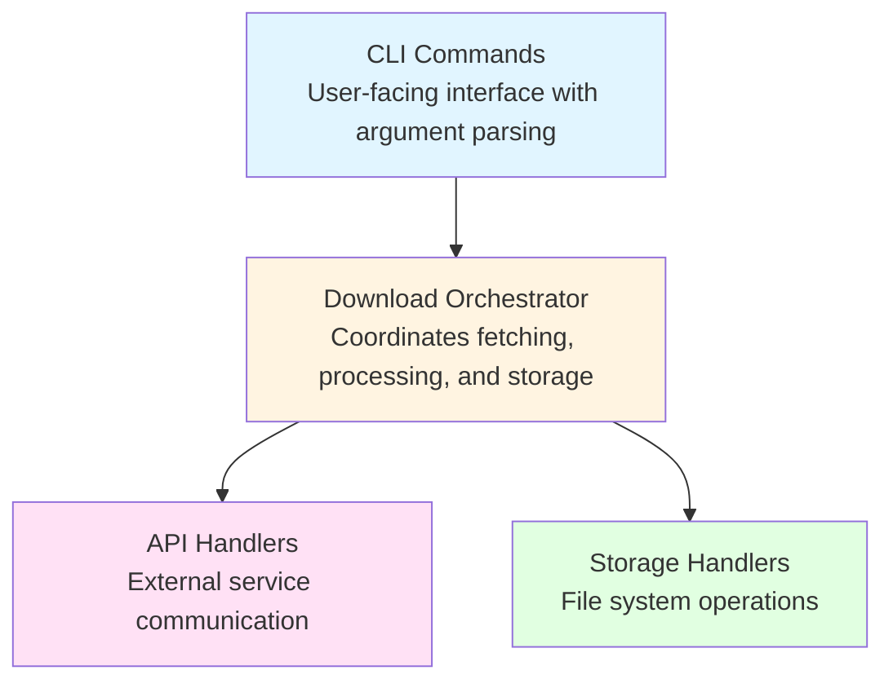
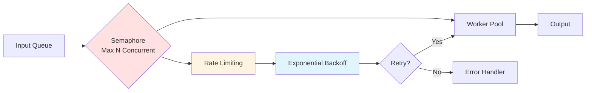
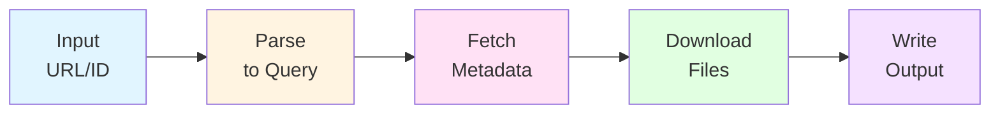
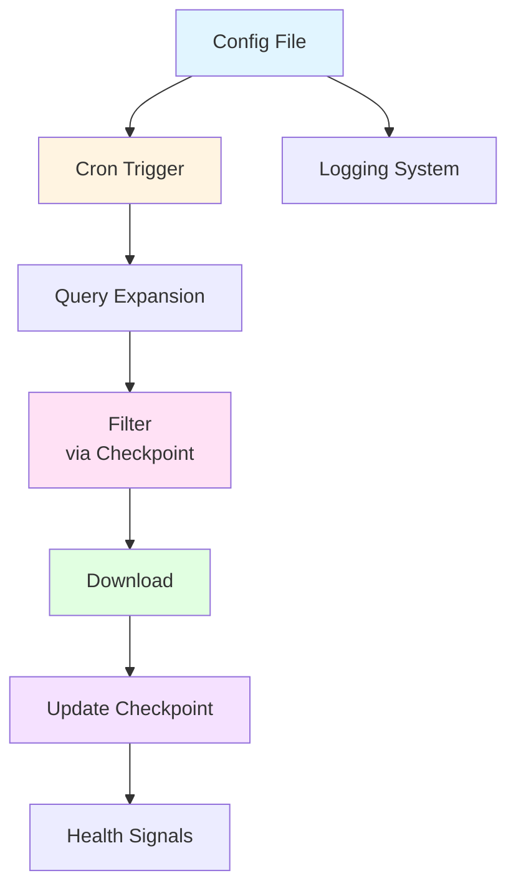
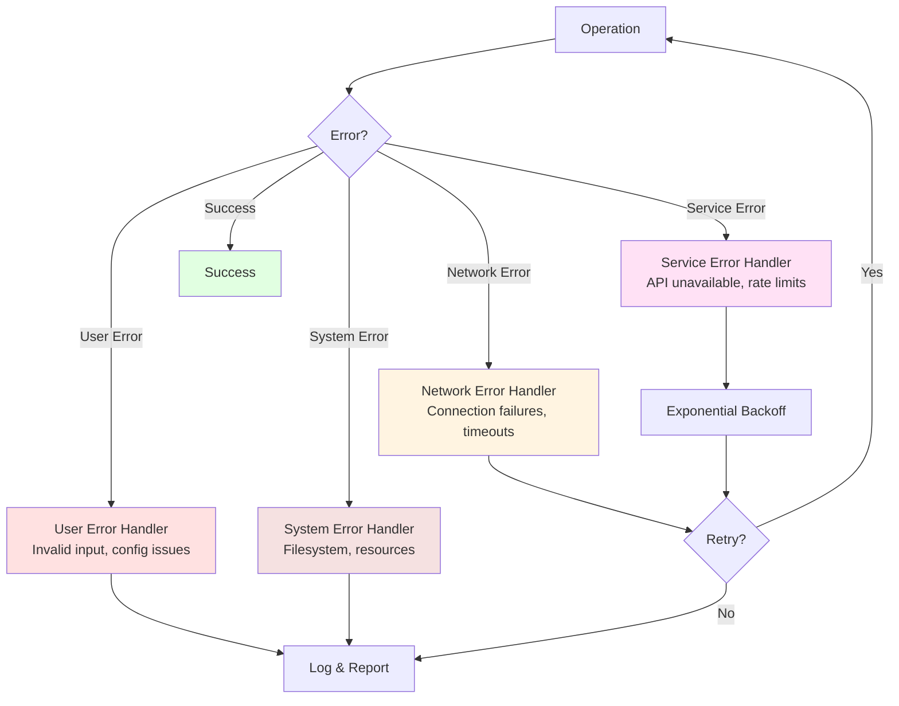
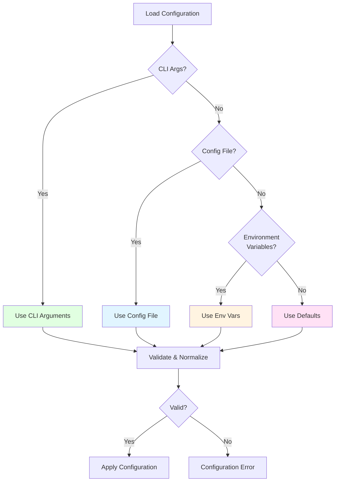

# Architecture Overview

This document describes the high-level architecture and design principles of this CLI downloader application.

## Core Design Principles

### 1. Separation of Concerns

The codebase is organized into distinct layers with clear responsibilities:

- **Command Layer**: CLI interface and user interaction
- **Business Logic Layer**: Download orchestration and data processing
- **API Layer**: External service communication
- **Utility Layer**: Reusable components and helpers

### 2. Type Safety

- Runtime validation using schema validation libraries
- Strict TypeScript configuration for compile-time safety
- Explicit error types for different failure scenarios

### 3. Resilience

- Exponential backoff for retries
- Concurrent operation limiting to prevent resource exhaustion
- Checkpoint mechanisms for resumable operations

## System Architecture

## Key Components

### Command Execution Flow

1. **Input Parsing**: URL/ID to query parameters
2. **Data Fetching**: Retrieve metadata and file lists
3. **Download Coordination**: Manage concurrent downloads with rate limiting
4. **Output Generation**: Write to filesystem (directory or archive)

### API Communication

- Dynamic endpoint construction based on metadata
- Header management for authentication and identification
- Binary data handling for efficient transfers

### Storage Abstraction

- Unified interface for different output formats
- Stream-based operations for memory efficiency
- Atomic operations to prevent partial writes

### State Management

- Checkpoint files track completed operations
- Resume capability from interruptions
- Efficient set operations for filtering completed items

## Concurrency Model

- Semaphore controls maximum parallel operations
- Backoff mechanism handles transient failures
- Queue ensures orderly processing

## Data Flow

### One-time Execution Mode

### Scheduled Execution Mode

## Error Handling Strategy

### Error Types

- **User Errors**: Invalid input, configuration issues
- **Network Errors**: Connection failures, timeouts
- **Service Errors**: API unavailability, rate limiting
- **System Errors**: Filesystem issues, resource exhaustion

### Recovery Mechanisms

- Retries with exponential backoff for transient failures
- Checkpoint system for long-running operations
- Graceful degradation when possible
- Clear error messages for user-actionable issues

## Configuration Management

### Hierarchy

1. Command-line arguments (highest priority)
2. Configuration files (JSON with comments)
3. Environment variables
4. Default values (lowest priority)

### Validation

- Schema-based validation at load time
- Type coercion and normalization
- Fail-fast on invalid configuration

## Extensibility Points

### Adding New Features

- **New commands**: Extend command layer
- **New output formats**: Implement storage interface
- **New data sources**: Implement API interface
- **New filters**: Extend query parsing logic

## Performance Considerations

### Memory Management

- Stream-based processing for large files
- Chunked operations to avoid buffering entire datasets
- Garbage collection-friendly patterns

### Network Optimization

- Connection pooling through keep-alive
- Concurrent downloads with configurable limits
- Binary protocol support for efficiency

### Storage Optimization

- Batch operations where possible
- Efficient binary set operations using specialized data structures
- Minimal metadata overhead

## Testing Strategy

### Unit Tests

- Pure functions and business logic
- Mock external dependencies
- Edge cases and error conditions

### Integration Tests

- Component interaction
- File system operations
- Network behavior (with mocks)

### End-to-End Tests

- Full workflow validation
- Real-world scenarios
- Performance benchmarks

## Deployment Models

### Standalone Binary

- Self-contained executable
- Platform-specific builds
- Package manager distribution

### Container Deployment

- Multi-stage builds for size optimization
- Health check endpoints for orchestration
- Volume mounts for persistent data

### Scheduled Service

- Cron-based triggering
- Logging to structured output
- Monitoring through health signals

## Security Considerations

- No credential storage in code
- Environment variable-based secrets
- Proxy support for privacy
- Input validation to prevent injection attacks
- Minimal privilege requirements
